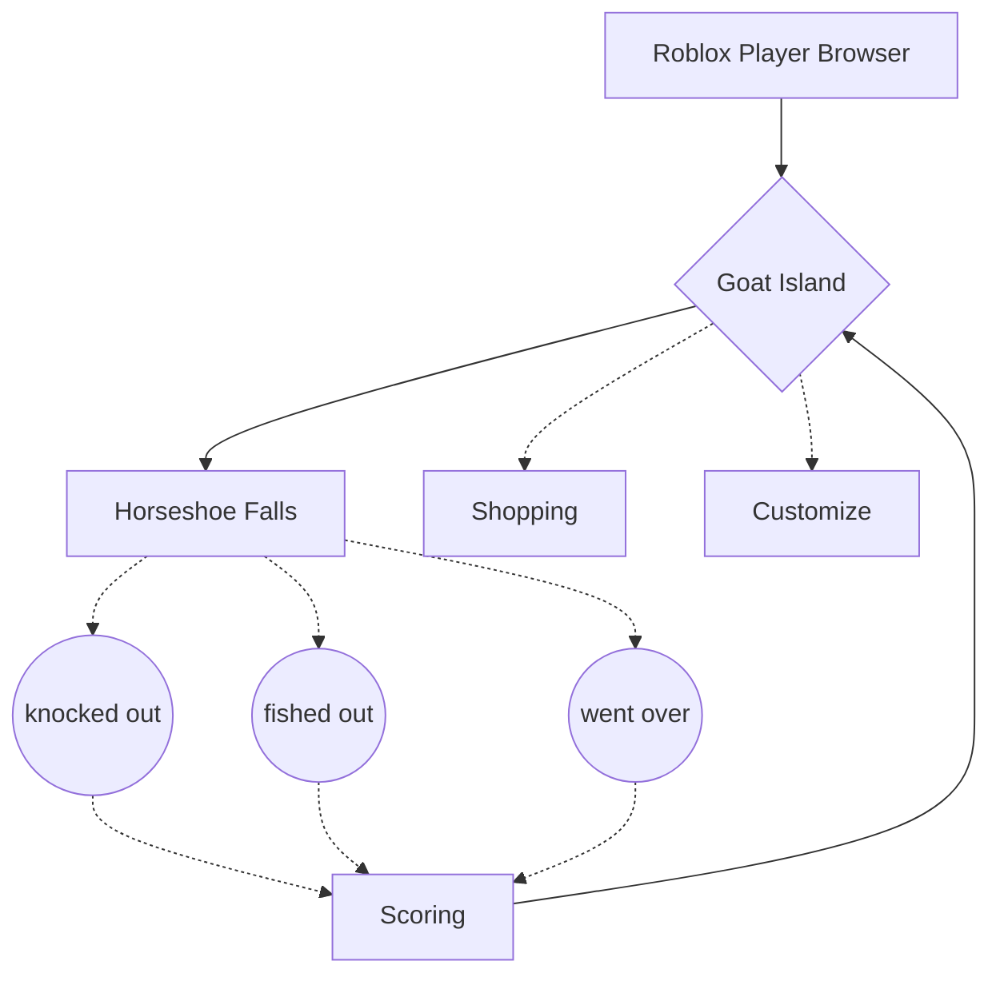

# Gameflow

```mermaid
graph TD
	browser[Roblox Player Browser] --> lobby{Goat Island}
	lobby --> river[Horseshoe Falls]
	lobby -.-> shopping[Shopping]
	lobby -.-> config[Customize]
	river -.-> knockout((knocked out))
	river -.-> fishout((fished out))
	river -.-> success((went over))
	score[Scoring] --> lobby
	knockout -.-> score
	fishout -.-> score
	success -.-> score
```
